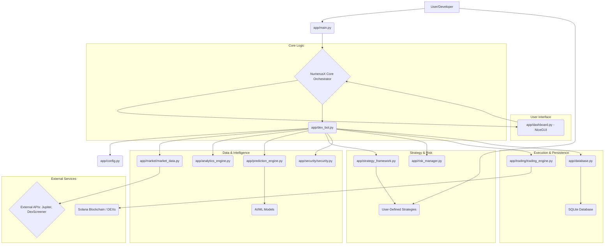
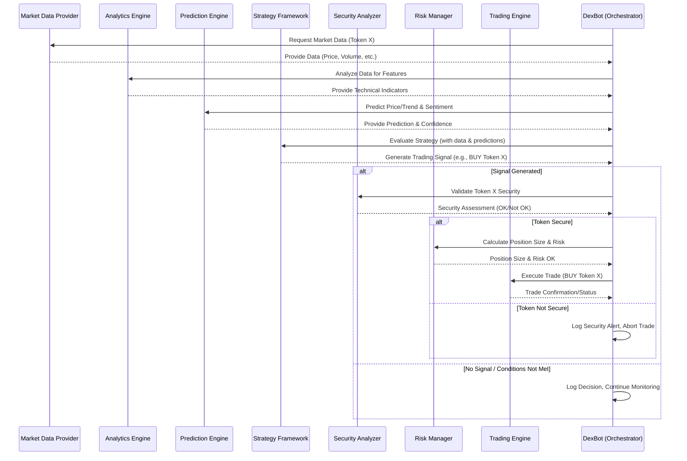

# NumerusX: Your Intelligent Navigator for Cryptocurrency Trading

NumerusX is a sophisticated software platform designed to empower users in the complex world of cryptocurrency trading. Think of it as an intelligent assistant that helps you make informed decisions, automate your trading strategies, and manage your digital assets on the Solana blockchain, a fast and efficient network for crypto transactions.

## What Can NumerusX Do For You?

At its core, NumerusX aims to make advanced trading techniques accessible and manageable. Here's how:

*   **Smart Trading Strategies**: NumerusX allows you to define and automate your own trading approaches. Whether you prefer to follow market trends, react to specific price movements, or employ more complex logic, the platform provides the tools to bring your strategies to life.
*   **AI-Powered Insights**: Going beyond simple automation, NumerusX leverages Artificial Intelligence (AI) to analyze market data, predict potential price movements, and even understand market sentiment by looking at social media trends. This helps in identifying opportunities and risks that might not be obvious at first glance.
*   **Risk Management First**: The cryptocurrency market can be volatile. NumerusX is built with a strong emphasis on managing risk. It helps you define safety nets, such as setting limits on potential losses, and employs techniques to protect your investments.
*   **Security Shield**: NumerusX includes features to help identify potentially risky tokens or fraudulent schemes, adding an extra layer of security to your trading activities.
*   **Market Understanding**: The platform constantly gathers and processes market data from various sources, ensuring that your trading decisions are based on the latest information available. It can analyze liquidity (how easily an asset can be bought or sold) and track significant market events.
*   **Performance Tracking**: Understand how well your strategies are performing with clear reports and visualizations. This allows you to learn, adapt, and refine your approach over time.
*   **User-Friendly Dashboard**: (Under development) A clear and intuitive dashboard will provide a central hub to monitor your trading bot, view your portfolio, analyze market trends, and control the bot's operations.

## How Does It Work? (A Simplified View)

NumerusX is like a team of specialized robots working together:

1.  **The Data Gatherer (`MarketDataProvider`)**: This component is constantly watching the market, collecting price information, news, and other relevant data from various exchanges and sources on the Solana network (like Jupiter and DexScreener).
2.  **The Analyst (`AnalyticsEngine` & `PredictionEngine`)**: This is where the "smarts" come in. It uses the collected data to:
    *   Identify market trends and patterns.
    *   Employ AI and machine learning to predict potential price changes.
    *   Gauge market sentiment (e.g., is the general feeling about a token positive or negative?).
    *   Understand the underlying causes of market movements.
3.  **The Strategist (`StrategyFramework` & individual strategy files)**: You define your trading rules here. Based on the Analyst's insights, the Strategist decides when to suggest a buy or sell action. You can have multiple strategies, and the system can even learn which ones work best under different market conditions.
4.  **The Risk Manager (`RiskManager`)**: Before any action is taken, this component assesses the potential risks. It decides how much to trade based on your predefined risk tolerance and current market volatility, aiming to protect your capital.
5.  **The Security Guard (`Security`)**: This module checks tokens for red flags, helping to avoid scams or highly risky assets.
6.  **The Executor (`TradingEngine`)**: Once a decision is made and deemed safe, this component carries out the actual trades on the Solana network, interacting with Decentralized Exchanges (DEXs). It aims for the best possible execution price and handles the technicalities of the transaction.
7.  **The Record Keeper (`Database`)**: All trades, decisions, and important events are logged for review and analysis.
8.  **The Control Panel (`Dashboard` - in progress)**: This will be your window into NumerusX, allowing you to monitor everything, make adjustments, and see your results.

## Visualizing NumerusX: Architecture and Flow

To better understand how NumerusX operates, here are a couple of diagrams:

### High-Level Architecture



### Typical Trading Signal Workflow



## Project Structure

```
NumerusX/
├── app/
│   ├── __init__.py
│   ├── api_routes.py         # FastAPI routes for external interaction (if any)
│   ├── analytics_engine.py     # Advanced market analysis and feature engineering
│   ├── config.py             # Centralized configuration management
│   ├── dashboard.py          # Main NiceGUI dashboard application logic
│   ├── database.py           # SQLite database interaction and schema
│   ├── dex_bot.py            # Core bot logic, orchestrates strategies and execution
│   ├── gui.py                # (Potentially legacy or helper UI components for NiceGUI)
│   ├── logger.py             # Application-wide logging setup
│   ├── main.py               # Main entry point for the application
│   ├── monitoring.py         # System monitoring and performance tracking
│   ├── prediction_engine.py  # AI/ML models for price/trend prediction & sentiment
│   ├── risk_manager.py       # Position sizing, portfolio risk controls
│   ├── strategy_debug.py     # Tools for debugging trading strategies
│   ├── strategy_evaluator.py # Performance evaluation of trading strategies
│   ├── strategy_framework.py # Base classes and utilities for creating strategies
│   ├── wallet.py             # Solana wallet management and key handling
│   ├── examples/             # Example strategies and usage scenarios
│   │   └── simple_strategy_example.py
│   ├── market/               # Market data acquisition and management
│   │   └── market_data.py    # Unified provider for Jupiter, DexScreener, etc.
│   ├── security/             # Token security analysis and validation
│   │   └── security.py
│   └── trading/              # Trading execution logic
│       └── trading_engine.py # Interface with Solana DEXs (e.g., Jupiter) for swaps
├── Docker/
│   └── docker-compose.yml    # Docker container orchestration
├── todo/                     # Task lists and planning documents
├── .gitignore
├── logo.jpg
├── README.md
└── requirements.txt        # Python package dependencies
```

## Core Components In-Depth

Here\'s a more detailed look at the key components:

1.  **`app/config.py` (Configuration Manager)**
    *   Centralizes all application settings, API keys, trading parameters (slippage, max positions, etc.), and paths.
    *   Loads settings from environment variables (`.env` file) using `python-dotenv`, providing defaults where applicable.
    *   Ensures consistent access to configuration throughout the application.

2.  **`app/market/market_data.py` (Market Data Provider)**
    *   Consolidates all external API calls for market data (prices, historical data, token info, liquidity) from sources like Jupiter, DexScreener.
    *   Implements robust caching (e.g., `TTLCache`) to reduce API call frequency and latency.
    *   Handles API rate limits gracefully using `tenacity` for retries with exponential backoff.
    *   Provides fallback mechanisms if one data source fails.
    *   Standardizes data formats received from different APIs into a consistent internal representation.

3.  **`app/analytics_engine.py` (Market Analytics Engine)**
    *   Performs advanced analysis on raw market data to generate features for strategies and prediction models.
    *   Calculates various technical indicators (RSI, MACD, Bollinger Bands, ATR, etc.).
    *   May include on-chain analysis capabilities (e.g., tracking whale movements, if APIs permit).
    *   Capable of multi-timeframe analysis to identify correlations and divergences.
    *   Can identify support/resistance levels using volume profiles or other techniques.

4.  **`app/prediction_engine.py` (AI Prediction Engine)**
    *   Houses Machine Learning (ML) and AI models for forecasting price movements, market trends, and classifying market regimes (trending, ranging, volatile).
    *   May integrate Natural Language Processing (NLP) for sentiment analysis from social media or news feeds.
    *   Manages model training, evaluation, and persistence (e.g., using `scikit-learn`, `PyTorch`, `joblib`).
    *   Can employ reinforcement learning techniques to optimize strategy parameters over time.

5.  **`app/strategy_framework.py` (Strategy Framework)**
    *   Provides base classes (`Strategy`, `Signal`) and a structured way to define, test, and manage various trading strategies.
    *   Allows for pluggable strategies, making it easy to add new ones.
    *   `strategy_evaluator.py` is used to backtest strategies against historical data and calculate performance metrics (Sharpe ratio, ROI, drawdown).
    *   `strategy_debug.py` offers tools to inspect and debug strategy behavior.

6.  **`app/security/security.py` (Token Security Analyzer)**
    *   Performs due diligence on Solana tokens before trading.
    *   Validates token addresses and checks for known scam patterns or rug pull indicators.
    *   Analyzes token liquidity, holder distribution, and other on-chain metrics to assess risk.
    *   Aims to protect the bot from interacting with malicious or extremely high-risk assets.

7.  **`app/risk_manager.py` (Risk Management System)**
    *   Implements crucial risk controls for trading operations.
    *   Calculates optimal position sizes based on methodologies like the Kelly Criterion, adjusted for current volatility and account size.
    *   Manages overall portfolio exposure, potentially considering asset correlations.
    *   Can enforce dynamic stop-loss and take-profit levels based on market volatility (e.g., using ATR).
    *   May include circuit breakers to halt trading during severe drawdowns.

8.  **`app/trading/trading_engine.py` (Trading Execution Engine)**
    *   Handles the direct interaction with Solana Decentralized Exchanges (DEXs), primarily Jupiter, to execute trades.
    *   Constructs, signs, and submits transactions to the Solana network.
    *   Manages transaction fee estimation (including priority fees) to optimize execution.
    *   Includes robust error handling and retry mechanisms for transaction submissions, accounting for network congestion or DEX-specific issues.
    *   Aims for best price execution and manages slippage according to configured limits.
    *   May implement advanced order types (limit orders, DCA) if supported by the DEX APIs.

9.  **`app/dex_bot.py` (Core Bot Orchestrator)**
    *   The central "brain" that ties all other components together.
    *   Runs the main trading loop: fetches market data, gets analysis and predictions, applies the selected strategy, checks risk, and executes trades via the `TradingEngine`.
    *   Manages the state of active trades and the portfolio.
    *   Interfaces with the `Database` to log trades and decisions.

10. **`app/database.py` (Database Interface)**
    *   Manages the persistence of data, such as trade history, blacklisted tokens, strategy performance metrics, and configuration settings.
    *   Uses SQLite for local data storage.
    *   Handles database initialization and potential schema migrations.

11. **`app/dashboard.py` & `app/gui.py` (User Interface)**
    *   Provides a web-based dashboard (using `NiceGUI`) for users to monitor the bot\'s activity, view portfolio performance, analyze market data, and control bot operations (start/stop, adjust settings).
    *   Aims for real-time updates and clear visualizations. `gui.py` might contain older or helper UI elements.

12. **`app/main.py` (Application Entry Point)**
    *   Initializes and starts the core application components, including the `DexBot` and the `Dashboard`.

This structure is designed to be modular, allowing for independent development and testing of each component, while facilitating complex interactions to achieve intelligent and automated trading.

## Getting Started

While NumerusX is a complex system, here\'s a general idea of how one might get started (details will vary based on the evolving state of the `main.py` and `dashboard.py`):

1.  **Prerequisites**:
    *   Python 3.9+
    *   Git
    *   Docker and Docker Compose (for containerized deployment)
    *   Access to a Solana RPC node (either a public one or your own).

2.  **Installation**:
    ```bash
    git clone https://your-repository-link/NumerusX.git # Replace with actual link
    cd NumerusX
    pip install -r requirements.txt
    ```

3.  **Configuration (`.env` file)**:
    *   Create a `.env` file in the root directory of the project.
    *   Populate it with necessary API keys (Jupiter, DexScreener, any sentiment analysis APIs), your Solana wallet private key (handle with extreme care!), RPC URL, and other trading parameters. Refer to `app/config.py` for all possible environment variables and their defaults.
    *   **Example `.env` structure**:
        ```env
        SOLANA_RPC_URL=https://api.mainnet-beta.solana.com
        JUPITER_API_KEY=your_jupiter_api_key_if_any
        # Wallet (ensure this is stored securely, especially for mainnet)
        WALLET_PATH=~/.config/solana/id.json 
        # or SOLANA_PRIVATE_KEY_BS58=your_base58_private_key
        
        # Trading Parameters
        BASE_ASSET_MINT=EPjFWdd5AufqSSqeM2qN1xzybapC8G4wEGGkZwyTDt1v # USDC
        MAX_POSITIONS=5
        # ... other parameters as defined in config.py
        ```

4.  **Running the Bot (Example - Docker)**:
    *   Ensure Docker is running.
    *   Build and run the application using Docker Compose:
        ```bash
        docker-compose up --build
        ```
    *   This will typically start the bot and the NiceGUI dashboard.

5.  **Accessing the Dashboard**:
    *   Open your web browser and navigate to the address provided by NiceGUI (usually `http://localhost:8080` or similar, check the console output).

6.  **Developing a Strategy**:
    *   Study `app/strategy_framework.py` and the examples in `app/examples/`.
    *   Create your own strategy file (e.g., `app/strategies/my_cool_strategy.py`) by inheriting from `Strategy`.
    *   Implement the `analyze` and `generate_signal` methods.
    *   Configure the bot (potentially via the dashboard or `config.py`) to use your new strategy.

7.  **Important Considerations**:
    *   **Security**: NEVER commit your private keys or sensitive API keys directly to your Git repository, especially if it\'s public. Use environment variables and `.gitignore` appropriately.
    *   **Testnet First**: Always test extensively on a Solana testnet or devnet environment before risking real funds on mainnet.
    *   **Logging**: Pay close attention to the logs generated by `app/logger.py` to understand the bot\'s behavior and troubleshoot issues.
    *   **Incremental Development**: If you\'re contributing or extending, focus on one component or feature at a time.

## The Goal: Intelligent and Secure Crypto Trading

NumerusX is an ambitious project that combines data analysis, artificial intelligence, and robust engineering to provide a powerful tool for navigating the cryptocurrency markets. It's designed for users who want to go beyond manual trading and leverage technology to enhance their trading performance and manage risks effectively.

Whether you're an experienced trader looking to automate complex strategies or someone keen to explore the potential of AI in finance, NumerusX offers a comprehensive platform to experiment, learn, and trade with greater insight.

## Disclaimer

Trading cryptocurrencies involves significant risk and can result in substantial financial losses. NumerusX is provided for educational and research purposes. Any actions taken based on the software's outputs are at your own risk. Always do your own research and consider consulting with a financial advisor.

