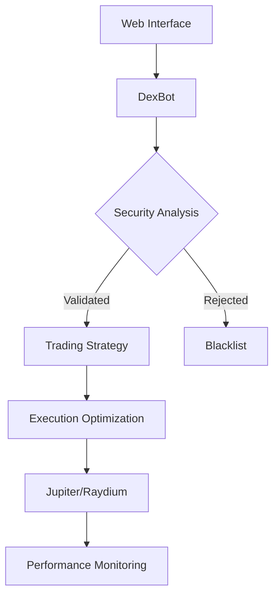

# NumerusX Documentation - Solana Trading Bot


## 📖 Introduction
**NumerusX** is an advanced algorithmic trading bot for Solana DEX, combining:
- Multi-protocol analysis (Jupiter + Raydium)
- Real-time risk detection
- Web control interface
- Automated portfolio management

## 🚀 Key Features
- 🛡️ Multi-layer security verification
- 📈 Strategy based on 12 technical indicators
- 🔄 Automatic transaction fee optimization
- 📊 Real-time performance dashboard
- 🚨 Intelligent emergency stop system

## 🛠 Installation

### Prerequisites
- Docker 20.10+
- Docker Compose 2.20+
- Solana API Key (optional)

### Installation via Docker
```bash
git clone https://github.com/your-repo/numerusx.git
cd numerusx
mkdir -p data config
docker-compose up --build
```

### Key Generation
```bash
# Generate encryption key
python3 -c "from cryptography.fernet import Fernet; print(f'ENCRYPTION_KEY={Fernet.generate_key().decode()}')" > .env

# Encrypt Solana private key
echo "ENCRYPTED_SOLANA_PK=$(python3 -c 'from cryptography.fernet import Fernet; import os; key = os.getenv("ENCRYPTION_KEY"); print(Fernet(key).encrypt(b"YOUR_PRIVATE_KEY").decode())')" >> .env
```

## ⚙ Configuration

### Environment Variables

| Variable | Description | Default Value |
|----------|------------|---------------|
| SOLANA_RPC_URL | Solana RPC URL | https://api.mainnet-beta.solana.com |
| ENCRYPTION_KEY | Fernet encryption key | - |
| ENCRYPTED_SOLANA_PK | Encrypted private key | - |
| LOG_LEVEL | Logging level | INFO |

### `config.py` File

#### Main Parameters:
```python
TRADE_THRESHOLD = 0.65  # Trade activation threshold
SCORE_WEIGHTS = (0.4, 0.3, 0.2, 0.1)  # Indicator weightings
MAX_POSITIONS = 5  # Maximum number of open positions
```

## 🏗 Architecture



## 📦 Main Modules

### 1. DexBot (`dex_bot.py`)
- Main trading loop
- Risk management
- Module coordination

#### Workflow:
1. Pair retrieval
2. Security filtering
3. Technical analysis
4. Optimized execution

### 2. Execution Engine (`trading_engine.py`)
#### Features:
- Multi-protocol price comparison
- Secure key management
- Real-time fee estimation

```python
engine = SolanaTradingEnginePro()
engine.execute_swap(SOL, USDC, 100)  # Example swap
```

### 3. Technical Analysis (`analytics_engine.py`)
#### Implemented Indicators:
- RSI (14 periods)
- MACD (26/12/9)
- ATR (14 periods)
- Market structure
- Volume analysis

### 4. Security (`security.py`)
#### Checks:
- Jupiter strict list verification
- On-chain liquidity analysis
- Rug pull detection
- Holder monitoring

## 🔒 Security & Monitoring

### Security Measures
- AES-256 key encryption
- Automatic blacklist
- Position limits
- Balance verification

### Monitoring
- **Web interface**: http://localhost:8080
- **Log files**: `data/dex_bot.log`
- **Prometheus metrics** (port 9090)