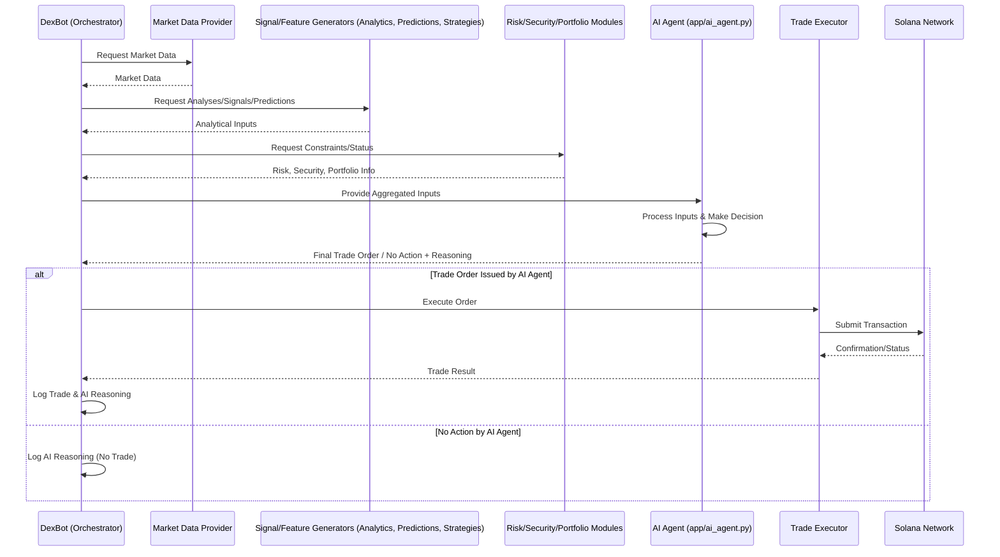

# NumerusX: Your Intelligent Navigator for Cryptocurrency Trading

NumerusX is a sophisticated software platform designed to empower users in the complex world of cryptocurrency trading. Think of it as an **intelligent agent** that helps you make informed decisions, automate your trading strategies, and manage your digital assets on the Solana blockchain, a fast and efficient network for crypto transactions.

## What Can NumerusX Do For You?

At its core, NumerusX aims to make advanced trading techniques accessible and manageable. Here's how:

*   **AI-Driven Decision Making**: NumerusX places a powerful AI Agent at its core. This agent synthesizes a vast array of information – market data, technical analysis, AI predictions, risk parameters, and even social sentiment – to make the final trading decisions.
*   **Smart Input Strategies**: While the AI Agent makes the ultimate call, NumerusX allows you to define and plug in various "input strategies" or "signal generators." These can range from traditional technical indicator-based logic to more complex analytical modules. The AI Agent intelligently weighs these inputs.
*   **Comprehensive Market Analysis**: The system leverages multiple AI and analytical modules to understand market dynamics, predict potential price movements, and gauge sentiment. These insights become critical inputs for the central AI Agent.
*   **Risk Management First**: The cryptocurrency market can be volatile. NumerusX is built with a strong emphasis on managing risk. Risk parameters and portfolio status are key inputs to the AI Agent, ensuring decisions align with predefined safety nets.
*   **Security Shield**: NumerusX includes features to help identify potentially risky tokens or fraudulent schemes. Security assessments also feed into the AI Agent's decision process.
*   **Continuous Market Understanding**: The platform constantly gathers and processes market data, ensuring that the AI Agent's decisions are based on the latest information.
*   **Performance Tracking & Transparency**: Understand how well the AI Agent and its input strategies are performing. The system aims to provide clear logs of the AI Agent's reasoning.
*   **User-Friendly Dashboard**: (Under development) A clear and intuitive dashboard will provide a central hub to monitor your trading bot, view your portfolio, analyze market trends, observe the AI Agent's decisions, and control its operations.

## How Does It Work? (An AI Agent-Centric View)

NumerusX operates with a central AI Agent that synthesizes information from a team of specialized modules:

1.  **The Data Gatherer (`MarketDataProvider`)**: Constantly watches the market, collecting price information, news, and other relevant data (Jupiter, DexScreener).
2.  **The Signal & Feature Generators (Formerly Analyst & Strategist - `AnalyticsEngine`, `PredictionEngine`, `StrategyFramework`, `app/strategies/*`)**: These modules now act as sophisticated input providers for the AI Agent:
    *   `AnalyticsEngine`: Performs technical analysis and feature engineering.
    *   `PredictionEngine`: Employs AI/ML for price predictions, market regime classification, and sentiment analysis.
    *   `StrategyFramework` & `app/strategies/*`: User-defined or pre-built logic modules that generate specific signals or analytical outputs based on market data and indicators.
3.  **The Central AI Agent (`AIAgent`)**: This is the brain. It receives and processes all the inputs from the Data Gatherer and the various Signal & Feature Generators. It also considers risk parameters from the Risk Manager and security inputs. Based on its internal logic (which could be a complex ML model, a meta-learner, or a Reinforcement Learning agent), it makes the final, holistic decision on whether to trade, what to trade, and how much.
4.  **The Risk Manager (`RiskManager`)**: Provides critical risk assessment data (e.g., current exposure, available capital, volatility-based limits) as direct input to the AI Agent, ensuring its decisions adhere to safety protocols.
5.  **The Security Guard (`Security`)**: Checks tokens for red flags. This security assessment is another input for the AI Agent.
6.  **The Orchestrator (`DexBot`)**: This component manages the flow of information. It gathers data from all provider modules, feeds it to the AI Agent, receives the final decision from the AI Agent, and then passes this decision to the Executor.
7.  **The Executor (`TradeExecutor` & `TradingEngine`)**: Once the AI Agent makes a decision (conveyed via `DexBot`), these components carry out the actual trades on the Solana network.
8.  **The Record Keeper (`Database`)**: All trades, AI Agent decisions (including key inputs and reasoning), and important events are logged.
9.  **The Control Panel (`Dashboard` - in progress)**: Your window into NumerusX, allowing you to monitor the AI Agent, its inputs, and overall performance.

## Visualizing NumerusX: Architecture and Flow (AI Agent Centric)

### High-Level Architecture (Centred on AI Agent)

```mermaid
graph TD
    A[User/Developer] --> B(app/main.py);
    B --> C{NumerusX Core Orchestrator (app/dex_bot.py)};
    C --> D(app/dashboard.py - NiceGUI);
    
    subgraph "Input & Data Providers"
        DATASRC(app/market/market_data.py);
        DATASRC --> EXTAPI{External APIs: Jupiter, DexScreener, Social};
        TECH_ANALYSIS(app/analytics_engine.py);
        PREDICT_AI(app/prediction_engine.py);
        STRAT_FRWK(app/strategy_framework.py);
        USER_STRATS(app/strategies/*);
        RISK_INFO(app/risk_manager.py);
        SEC_INFO(app/security/security.py);
        PORT_INFO(app/portfolio_manager.py);
    end

    subgraph "Central Decision Core"
        AI_AGENT_CORE[<<app/ai_agent.py>>
AI Agent Décisionnel Central];
    end

    subgraph "Execution & Persistence"
        EXEC_ENG(app/trade_executor.py);
        TRADE_SYS(app/trading/trading_engine.py);
        TRADE_SYS --> SOLANA(Solana Blockchain / DEXs);
        DB_STORE(app/database.py);
        DB_STORE --> SQLITEDB(SQLite Database);
    end

    C --> DATASRC;
    C --> TECH_ANALYSIS;
    C --> PREDICT_AI;
    C --> STRAT_FRWK;
    STRAT_FRWK --> USER_STRATS;
    C --> RISK_INFO;
    C --> SEC_INFO;
    C --> PORT_INFO;

    DATASRC --> AI_AGENT_CORE;
    TECH_ANALYSIS --> AI_AGENT_CORE;
    PREDICT_AI --> AI_AGENT_CORE;
    USER_STRATS --> AI_AGENT_CORE;
    RISK_INFO --> AI_AGENT_CORE;
    SEC_INFO --> AI_AGENT_CORE;
    PORT_INFO --> AI_AGENT_CORE;
    
    AI_AGENT_CORE --> C; %% AI Agent returns decision to Orchestrator
    C --> EXEC_ENG;
    EXEC_ENG --> TRADE_SYS;
    EXEC_ENG --> DB_STORE; %% For trade recording
    AI_AGENT_CORE --> DB_STORE; %% For decision logging

    D --> C;
    A --> F(app/config.py);
    C --> F;
```

### Trading Decision Workflow (AI Agent Centric)



## Project Structure

```
NumerusX/
├── app/
│   ├── __init__.py
│   ├── ai_agent.py           # NEW: Central AI Agent for decision making
│   ├── api_routes.py         # FastAPI routes for external interaction (if any)
│   ├── analytics_engine.py     # Advanced market analysis and feature engineering (Input to AI Agent)
│   ├── config.py             # Centralized configuration management
│   ├── dashboard.py          # Main NiceGUI dashboard application logic
│   ├── database.py           # SQLite database interaction and schema
│   ├── dex_bot.py            # Core bot logic, orchestrates data to AI Agent and executes its decisions
│   ├── gui.py                # (Potentially legacy or helper UI components for NiceGUI)
│   ├── logger.py             # Application-wide logging setup
│   ├── main.py               # Main entry point for the application
│   ├── monitoring.py         # System monitoring and performance tracking
│   ├── portfolio_manager.py  # Manages portfolio state (Input to AI Agent, updated by Executor)
│   ├── prediction_engine.py  # AI/ML models for price/trend prediction & sentiment (Input to AI Agent)
│   ├── risk_manager.py       # Position sizing, portfolio risk controls (Input to AI Agent)
│   ├── strategy_debug.py     # Tools for debugging trading strategies
│   ├── strategy_evaluator.py # Performance evaluation of trading strategies
│   ├── strategy_framework.py # Base classes for creating signal/feature modules (Input to AI Agent)
│   ├── trade_executor.py     # Handles the execution of trades decided by the AI Agent
│   ├── wallet.py             # Solana wallet management and key handling
│   ├── examples/             # Example strategies and usage scenarios
│   │   └── simple_strategy_example.py
│   ├── market/               # Market data acquisition and management
│   │   └── market_data.py    # Unified provider for Jupiter, DexScreener, etc. (Input to AI Agent)
│   ├── security/             # Token security analysis and validation (Input to AI Agent)
│   │   └── security.py
│   ├── strategies/           # Specific strategy modules (Input to AI Agent)
│   │   └── momentum_strategy.py
│   │   └── mean_reversion_strategy.py
│   │   └── trend_following_strategy.py
│   └── trading/              # Trading execution logic
│       └── trading_engine.py # Interface with Solana DEXs (e.g., Jupiter) for swaps
├── Docker/
│   └── docker-compose.yml    # Docker container orchestration
├── todo/                     # Task lists and planning documents
├── .gitignore
├── logo.jpg
├── README.md
└── requirements.txt        # Python package dependencies
```

## Core Components In-Depth (Reflecting AI Agent Architecture)

1.  **`app/config.py` (Configuration Manager)**
    *   (Largely unchanged) Centralizes all application settings.

2.  **`app/market/market_data.py` (Market Data Provider)**
    *   (Largely unchanged) Consolidates external API calls for market data. This data is a primary *input to the AI Agent* via the `DexBot` orchestrator.

3.  **`app/analytics_engine.py` (Market Analytics Engine - Input Provider)**
    *   **Role Redefined**: Performs advanced analysis on raw market data to generate features and structured analytical insights. These are *inputs to the AI Agent*, not direct trade decisions.

4.  **`app/prediction_engine.py` (AI Prediction Engine - Input Provider)**
    *   **Role Redefined**: Houses ML/AI models for forecasts, regime classification, sentiment analysis. Its outputs are crucial *inputs for the AI Agent*.

5.  **`app/strategy_framework.py` & `app/strategies/*` (Signal/Feature Modules - Input Providers)**
    *   **Role Redefined**: `BaseStrategy` defines an interface for modules that generate specific analytical signals, scores, or features based on their internal logic. The outputs of these strategy modules are *inputs to the AI Agent*.

6.  **`app/ai_agent.py` (Central AI Agent - New Core Component)**
    *   **Rôle**: The definitive decision-making unit of NumerusX.
    *   Receives a comprehensive set of inputs: market data, technical analyses from `analytics_engine`, predictions from `prediction_engine`, signals from various `strategies`, risk parameters from `risk_manager`, security assessments from `security_checker`, and current portfolio status from `portfolio_manager`.
    *   Contains the core intelligence (e.g., advanced ML model, ensemble, RL agent) to synthesize these diverse inputs.
    *   Outputs a final, actionable trade order (buy, sell, hold, amount, SL/TP) or a decision to take no action, along with a log of its reasoning.

7.  **`app/dex_bot.py` (Orchestrator)**
    *   **Role Redefined**: Manages the primary operational loop.
    *   Orchestrates the collection of data from all provider modules (`MarketDataProvider`, `AnalyticsEngine`, `PredictionEngine`, `StrategyFramework` modules, `RiskManager`, `SecurityChecker`, `PortfolioManager`).
    *   Passes the aggregated set of inputs to the `AIAgent`.
    *   Receives the final trade decision from the `AIAgent`.
    *   Instructs the `TradeExecutor` to carry out the AI Agent's decision.

8.  **`app/risk_manager.py` (Risk Information Provider)**
    *   **Role Redefined**: Calculates risk metrics, potential position sizes based on overall portfolio risk, drawdown limits, etc. These serve as critical *constraints and inputs for the AI Agent*.

9.  **`app/security/security.py` (Security Information Provider)**
    *   **Role Redefined**: Provides security assessments of tokens as *input to the AI Agent*.

10. **`app/portfolio_manager.py` (Portfolio State Provider)**
    *   **Role Redefined**: Tracks current holdings and cash balance. This state is an *input to the AI Agent*. It is updated by `TradeExecutor` after trades.

11. **`app/trade_executor.py` & `app/trading/trading_engine.py` (Execution Layer)**
    *   (Largely unchanged role) `TradeExecutor` takes the specific trade order (now originating from the AI Agent via `DexBot`) and uses `TradingEngine` to interact with the Solana DEXs.

12. **`app/database.py` (Data Persistence)**
    *   (Largely unchanged) Stores trades, blacklists, etc. Will now also store the AI Agent's decisions and its reasoning logs.

13. **`app/dashboard.py` (User Interface)**
    *   Will be enhanced to display information about the AI Agent's decisions, its reasoning, and the key inputs it considered.

## Getting Started

While NumerusX is a complex system, here\'s a general idea of how one might get started (details will vary based on the evolving state of the `main.py` and `dashboard.py`):

1.  **Prerequisites**:
    *   Python 3.9+
    *   Git
    *   Docker and Docker Compose (for containerized deployment)
    *   Access to a Solana RPC node (either a public one or your own).

2.  **Installation**:
    ```bash
    git clone https://your-repository-link/NumerusX.git # Replace with actual link
    cd NumerusX
    pip install -r requirements.txt
    ```

3.  **Configuration (`.env` file)**:
    *   Create a `.env` file in the root directory of the project.
    *   Populate it with necessary API keys (Jupiter, DexScreener, any sentiment analysis APIs), your Solana wallet private key (handle with extreme care!), RPC URL, and other trading parameters. Refer to `app/config.py` for all possible environment variables and their defaults.
    *   **Example `.env` structure**:
        ```env
        SOLANA_RPC_URL=https://api.mainnet-beta.solana.com
        JUPITER_API_KEY=your_jupiter_api_key_if_any
        # Wallet (ensure this is stored securely, especially for mainnet)
        WALLET_PATH=~/.config/solana/id.json 
        # or SOLANA_PRIVATE_KEY_BS58=your_base58_private_key
        
        # Trading Parameters
        BASE_ASSET_MINT=EPjFWdd5AufqSSqeM2qN1xzybapC8G4wEGGkZwyTDt1v # USDC
        MAX_POSITIONS=5
        # ... other parameters as defined in config.py
        ```

4.  **Running the Bot (Example - Docker)**:
    *   Ensure Docker is running.
    *   Build and run the application using Docker Compose:
        ```bash
        docker-compose up --build
        ```
    *   This will typically start the bot and the NiceGUI dashboard.

5.  **Accessing the Dashboard**:
    *   Open your web browser and navigate to the address provided by NiceGUI (usually `http://localhost:8080` or similar, check the console output).

6.  **Developing a Strategy**:
    *   Study `app/strategy_framework.py` and the examples in `app/examples/`.
    *   Create your own strategy file (e.g., `app/strategies/my_cool_strategy.py`) by inheriting from `Strategy`.
    *   Implement the `analyze` and `generate_signal` methods.
    *   Configure the bot (potentially via the dashboard or `config.py`) to use your new strategy.

7.  **Important Considerations**:
    *   **Security**: NEVER commit your private keys or sensitive API keys directly to your Git repository, especially if it\'s public. Use environment variables and `.gitignore` appropriately.
    *   **Testnet First**: Always test extensively on a Solana testnet or devnet environment before risking real funds on mainnet.
    *   **Logging**: Pay close attention to the logs generated by `app/logger.py` to understand the bot\'s behavior and troubleshoot issues.
    *   **Incremental Development**: If you\'re contributing or extending, focus on one component or feature at a time.

## The Goal: Intelligent and Secure Crypto Trading

NumerusX is an ambitious project that combines data analysis, artificial intelligence, and robust engineering to provide a powerful tool for navigating the cryptocurrency markets. It's designed for users who want to go beyond manual trading and leverage technology to enhance their trading performance and manage risks effectively.

Whether you're an experienced trader looking to automate complex strategies or someone keen to explore the potential of AI in finance, NumerusX offers a comprehensive platform to experiment, learn, and trade with greater insight.

## Disclaimer

Trading cryptocurrencies involves significant risk and can result in substantial financial losses. NumerusX is provided for educational and research purposes. Any actions taken based on the software's outputs are at your own risk. Always do your own research and consider consulting with a financial advisor.

