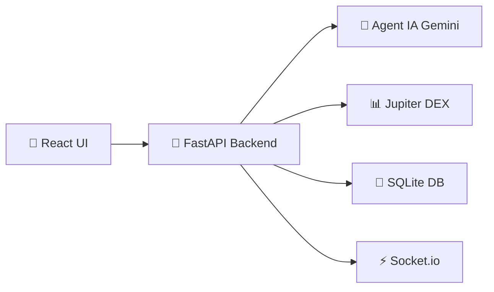

# 🚀 NumerusX

**Bot de trading crypto alimenté par IA pour Solana** 

<div align="center">


</div>

## 🎯 Qu'est-ce que NumerusX ?

Un bot de trading automatisé qui utilise **l'intelligence artificielle** (Gemini 2.5 Flash) pour analyser les marchés crypto et exécuter des trades sur **Solana** via Jupiter DEX.

### ✨ Fonctionnalités Principales

- 🤖 **Agent IA** - Décisions de trading intelligentes
- 📊 **Analyse technique** - RSI, MACD, Bollinger Bands
- 🔒 **Gestion des risques** - Stop-loss automatique et position sizing
- ⚡ **Temps réel** - Interface Socket.io pour suivi live
- 🛡️ **Sécurité** - Vérification anti-rugpull et analyse des tokens

## 🚦 Installation Ultra-Simple

### Prérequis
- Docker + Docker Compose
- Clés API (Google Gemini, Auth0)

### Installation
```bash
# 1. Cloner le projet
git clone <repository-url>
cd NumerusX

# 2. Configurer vos clés
cp .env .env.local
# Éditer .env.local avec vos vraies clés

# 3. Démarrer
docker compose up
```

**C'est tout ! 🎉**

### 🌐 URLs
- **Interface**: http://localhost:5173
- **API**: http://localhost:8000
- **Documentation**: http://localhost:8000/docs

## ⚙️ Configuration Rapide

### Backend (.env.local)
```bash
# APIs (OBLIGATOIRE)
GOOGLE_API_KEY=your-google-api-key
JUPITER_API_KEY=your-jupiter-api-key  
SOLANA_PRIVATE_KEY_BS58=your-solana-key

# Auth0 (OBLIGATOIRE)
AUTH_PROVIDER_JWKS_URI=https://domain.auth0.com/.well-known/jwks.json
AUTH_PROVIDER_ISSUER=https://domain.auth0.com/
AUTH_PROVIDER_AUDIENCE=your-api-identifier

# Sécurité (OBLIGATOIRE)
JWT_SECRET_KEY=your-jwt-secret
MASTER_ENCRYPTION_KEY=your-encryption-key
```

### Frontend (numerusx-ui/.env)
```bash
# Auth0 Frontend
VITE_APP_AUTH0_DOMAIN=domain.auth0.com
VITE_APP_AUTH0_CLIENT_ID=your-client-id
VITE_APP_AUTH0_AUDIENCE=your-api-identifier

# Backend
VITE_APP_BACKEND_URL=http://localhost:8000
VITE_APP_SOCKET_URL=http://localhost:8000
```

## 🏗️ Architecture



## 📋 Roadmap

| Phase | Status | Description |
|-------|--------|-------------|
| **Backend** | ✅ 95% | API, IA, Trading, Database |
| **Frontend** | ⚠️ 30% | Interface React (EN COURS) |
| **Production** | ❌ 10% | Monitoring, CI/CD, Analytics |

**🚨 PRIORITÉ**: Frontend (voir `todo/2-FRONTEND-CRITICAL.md`)

## 🛠️ Stack Technique

### Backend
- **FastAPI** - API REST haute performance
- **Socket.io** - Communication temps réel  
- **SQLite** - Base de données simple
- **Gemini 2.5 Flash** - Intelligence artificielle
- **Jupiter SDK v6** - Trading sur Solana

### Frontend  
- **React 18** - Interface utilisateur
- **TypeScript** - Type safety
- **Radix UI** - Composants accessible
- **Tailwind CSS** - Styling moderne
- **Auth0** - Authentification

## 📖 Documentation

- `todo/0-architecte.md` - Architecture complète
- `todo/1-BACKEND-DONE.md` - ✅ Backend terminé
- `todo/2-FRONTEND-CRITICAL.md` - 🚨 Frontend à faire
- `todo/3-PRODUCTION-FEATURES.md` - 🚀 Fonctionnalités avancées

## 🆘 Problèmes Fréquents

```bash
# Auth0 non configuré
grep "DUMMY" .env  # Doit être vide

# Frontend ne démarre pas
cd numerusx-ui && npm install

# Docker permission denied
sudo docker compose up
```

## 🤝 Contribution

1. Frontend en priorité (composants React + Auth0)
2. Tests et optimisations
3. Fonctionnalités avancées

## ⚖️ Licence

MIT License - Voir LICENSE

---

<div align="center">
<strong>🚀 Prêt à trader avec l'IA ? Configurez vos clés et lancez `docker compose up` !</strong>
</div>