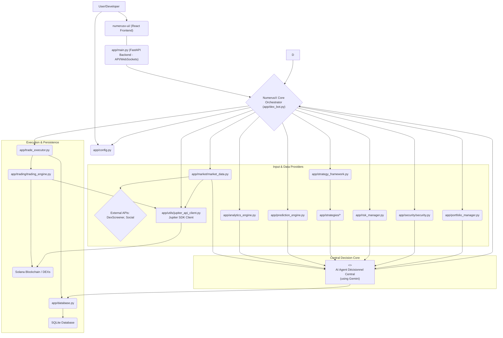

# NumerusX: Your Intelligent Navigator for Cryptocurrency Trading

NumerusX is a sophisticated software platform designed to empower users in the complex world of cryptocurrency trading. Think of it as an **intelligent agent** that helps you make informed decisions, automate your trading strategies, and manage your digital assets on the Solana blockchain, a fast and efficient network for crypto transactions.

## What Can NumerusX Do For You?

At its core, NumerusX aims to make advanced trading techniques accessible and manageable. Here's how:

*   **AI-Driven Decision Making**: NumerusX places a powerful AI Agent at its core. This agent synthesizes a vast array of information – market data, technical analysis, AI predictions, risk parameters, and even social sentiment – to make the final trading decisions.
*   **Smart Input Strategies**: While the AI Agent makes the ultimate call, NumerusX allows you to define and plug in various "input strategies" or "signal generators." These can range from traditional technical indicator-based logic to more complex analytical modules. The AI Agent intelligently weighs these inputs.
*   **Comprehensive Market Analysis**: The system leverages multiple AI and analytical modules to understand market dynamics, predict potential price movements, and gauge sentiment. These insights become critical inputs for the central AI Agent.
*   **Risk Management First**: The cryptocurrency market can be volatile. NumerusX is built with a strong emphasis on managing risk. Risk parameters and portfolio status are key inputs to the AI Agent, ensuring decisions align with predefined safety nets.
*   **Security Shield**: NumerusX includes features to help identify potentially risky tokens or fraudulent schemes. Security assessments also feed into the AI Agent's decision process.
*   **Continuous Market Understanding**: The platform constantly gathers and processes market data, ensuring that the AI Agent's decisions are based on the latest information.
*   **Performance Tracking & Transparency**: Understand how well the AI Agent and its input strategies are performing. The system aims to provide clear logs of the AI Agent's reasoning.
*   **User-Friendly Dashboard**: A modern, responsive web application built with React, ShadCN/UI, and Tailwind CSS provides a central hub to monitor your trading bot, view your portfolio, analyze market trends, observe the AI Agent's decisions, and control its operations. It communicates with the backend via APIs and WebSockets for real-time data.

## How Does It Work? (An AI Agent-Centric View)

NumerusX operates with a central AI Agent that synthesizes information from a team of specialized modules:

1.  **The Data Gatherer (`MarketDataProvider`)**: Constantly watches the market, collecting price information, news, and other relevant data (Jupiter, DexScreener).
2.  **The Signal & Feature Generators (Formerly Analyst & Strategist - `AnalyticsEngine`, `PredictionEngine`, `StrategyFramework`, `app/strategies/*`)**: These modules now act as sophisticated input providers for the AI Agent:
    *   `AnalyticsEngine`: Performs technical analysis and feature engineering.
    *   `PredictionEngine`: Employs AI/ML for price predictions, market regime classification, and sentiment analysis.
    *   `StrategyFramework` & `app/strategies/*`: User-defined or pre-built logic modules that generate specific signals or analytical outputs based on market data and indicators.
3.  **The Central AI Agent (`AIAgent`)**: This is the brain (initially leveraging **Google Gemini**). It receives and processes all the inputs from the Data Gatherer and the various Signal & Feature Generators. It also considers risk parameters from the Risk Manager and security inputs. Based on its internal logic (which could be a complex ML model, a meta-learner, or a Reinforcement Learning agent), it makes the final, holistic decision on whether to trade, what to trade, and how much.
4.  **The Risk Manager (`RiskManager`)**: Provides critical risk assessment data (e.g., current exposure, available capital, volatility-based limits) as direct input to the AI Agent, ensuring its decisions adhere to safety protocols.
5.  **The Security Guard (`Security`)**: Checks tokens for red flags. This security assessment is another input for the AI Agent.
6.  **The Orchestrator (`DexBot`)**: This component manages the flow of information. It gathers data from all provider modules, feeds it to the AI Agent, receives the final decision from the AI Agent, and then passes this decision to the Executor.
7.  **The Jupiter Maestro (`JupiterApiClient`)**: This new dedicated client handles all interactions with the Jupiter API v6 using the `jupiter-python-sdk`. It's utilized by the `MarketDataProvider` for fetching data and by the `TradingEngine` for executing swaps, limit orders, etc.
8.  **The Executor (`TradeExecutor` & `TradingEngine`)**: Once the AI Agent makes a decision (conveyed via `DexBot`), these components carry out the actual trades on the Solana network. The `TradingEngine` specifically uses the `JupiterApiClient` for optimal swap routing and other Jupiter-specific operations.
9.  **The Record Keeper (`Database`)**: All trades, AI Agent decisions (including key inputs and reasoning), and important events are logged.
10. **The Control Panel (`numerusx-ui/`)**: Your window into NumerusX, built as a React application. It allows you to monitor the AI Agent, its inputs, overall performance, and manage the bot. It interacts with the FastAPI backend.

## Visualizing NumerusX: Architecture and Flow (AI Agent Centric)

### High-Level Architecture (Centred on AI Agent)



### Trading Decision Workflow (AI Agent Centric)


## Project Structure

```
NumerusX/
├── app/                        # Python Backend (FastAPI, Bot Logic)
│   ├── __init__.py
│   ├── ai_agent.py           # NEW: Central AI Agent for decision making (using Gemini)
│   ├── api_routes.py         # FastAPI routes for UI interaction (API & WebSockets)
│   ├── analytics_engine.py     # Advanced market analysis and feature engineering (Input to AI Agent)
│   ├── config.py             # Centralized configuration management
│   ├── database.py           # SQLite database interaction and schema
│   ├── dex_bot.py            # Core bot logic, orchestrates data to AI Agent and executes its decisions
│   ├── logger.py             # Application-wide logging setup
│   ├── main.py               # Main entry point for the FastAPI backend application
│   ├── monitoring.py         # System monitoring and performance tracking
│   ├── portfolio_manager.py  # Manages portfolio state (Input to AI Agent, updated by Executor)
│   ├── prediction_engine.py  # AI/ML models for price/trend prediction & sentiment (Input to AI Agent)
│   ├── risk_manager.py       # Position sizing, portfolio risk controls (Input to AI Agent)
│   ├── strategy_debug.py     # Tools for debugging trading strategies
│   ├── strategy_evaluator.py # Performance evaluation of trading strategies
│   ├── strategy_framework.py # Base classes for creating signal/feature modules (Input to AI Agent)
│   ├── trade_executor.py     # Handles the execution of trades decided by the AI Agent
│   ├── wallet.py             # Solana wallet management and key handling
│   ├── examples/             # Example strategies and usage scenarios
│   │   └── simple_strategy_example.py
│   ├── market/               # Market data acquisition and management
│   │   └── market_data.py    # Unified provider for Jupiter, DexScreener, etc. (Input to AI Agent)
│   ├── security/             # Token security analysis and validation (Input to AI Agent)
│   │   └── security.py
│   ├── strategies/           # Specific strategy modules (Input to AI Agent)
│   │   └── momentum_strategy.py
│   │   └── mean_reversion_strategy.py
│   │   └── trend_following_strategy.py
│   ├── trading/              # Trading execution logic
│   │   └── trading_engine.py # Interface with Solana DEXs (via **JupiterApiClient** using Jupiter SDK v6) for swaps.
│   └── utils/                # Utility modules
│       └── jupiter_api_client.py # NEW: Client for Jupiter API v6 using jupiter-python-sdk
├── numerusx-ui/                # NEW: React Frontend Application
│   ├── public/
│   ├── src/
│   └── package.json            # (Structure as detailed in todo/01-todo-ui.md)
├── Docker/
│   ├── backend/              # Dockerfile for backend
│   ├── frontend/             # Dockerfile for frontend (React app)
│   └── docker-compose.yml    # Docker container orchestration
├── todo/                     # Task lists and planning documents
├── .env.example              # Example environment variables
├── .gitignore
├── logo.jpg
├── README.md
└── requirements.txt        # Python package dependencies (for backend)
```

## Core Components In-Depth (Reflecting AI Agent Architecture)

1.  **`