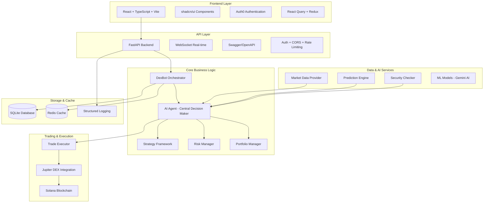

# 🏗️ NumerusX - Architecture Technique

## Vue d'Ensemble

NumerusX est une plateforme de trading algorithmique sur Solana avec un **Agent IA décisionnel central** qui analyse multiple sources de données pour prendre des décisions de trading intelligentes.

## Architecture Globale



## Composants Principaux

### 1. Frontend (React + TypeScript)

**Technologies**:
- React 18 + TypeScript + Vite
- shadcn/ui (42 composants UI modernes)
- Auth0 pour l'authentification
- React Query pour l'état serveur
- Socket.io pour le temps réel

**Structure**:
```
numerusx-ui/
├── src/
│   ├── components/        # Composants réutilisables
│   │   ├── ui/           # shadcn/ui components
│   │   ├── charts/       # Graphiques trading
│   │   └── layout/       # Layout components
│   ├── pages/            # Pages principales
│   │   ├── DashboardPage.tsx
│   │   ├── TradingPage.tsx
│   │   └── LoginPage.tsx
│   ├── hooks/            # Custom hooks
│   │   ├── useBot.ts     # Bot control
│   │   └── usePortfolio.ts
│   ├── lib/              # Utilities
│   │   ├── apiClient.ts  # API client
│   │   └── auth.ts       # Auth configuration
│   └── store/            # State management
```

### 2. Backend API (FastAPI)

**Technologies**:
- FastAPI avec WebSocket support
- Pydantic pour validation
- SQLAlchemy pour ORM
- JWT Authentication
- Rate limiting avec Redis

**Structure API**:
```
app/api/v1/
├── auth_routes.py         # Authentication
├── bot_routes.py          # Bot control
├── trades_routes.py       # Trading operations
├── portfolio_routes.py    # Portfolio management
├── ai_decisions_routes.py # AI decisions tracking
├── config_routes.py       # Configuration
└── system_routes.py       # System monitoring
```

### 3. Agent IA Central

**Rôle**: Cerveau décisionnel qui analyse tous les inputs pour prendre des décisions de trading.

**Inputs**:
- Données de marché en temps réel
- Signaux des stratégies techniques
- Prédictions ML/AI
- Contraintes de risque
- État du portefeuille
- Vérifications de sécurité

**Outputs**:
- Décision de trade (BUY/SELL/HOLD)
- Taille de position
- Prix d'entrée/sortie
- Justification de la décision

**Implémentation**:
```python
class AIAgent:
    def analyze_market_decision(
        self, 
        aggregated_inputs: AggregatedInputs
    ) -> TradeDecision:
        # Analyse via Gemini AI
        # Combine tous les signaux
        # Applique les contraintes
        # Retourne décision finale
```

### 4. Système de Trading

**Flux de décision**:
1. **Collecte de données** → Market Data Provider
2. **Génération de signaux** → Strategy Framework  
3. **Prédictions IA** → Prediction Engine
4. **Analyse globale** → **AI Agent** (décision finale)
5. **Validation** → Risk Manager + Security Checker
6. **Exécution** → Trade Executor → Jupiter DEX

### 5. Storage & Data

**Base de données SQLite**:
- Trades historiques
- Configurations utilisateur
- Performances des stratégies
- Logs des décisions IA

**Redis Cache**:
- Données de marché en cache
- Sessions utilisateur
- Rate limiting
- Temporary data

## Modèles de Données

### Trade
```python
class Trade(BaseModel):
    id: str
    timestamp: datetime
    symbol: str
    side: str  # BUY/SELL
    amount: float
    price: float
    status: str  # PENDING/EXECUTED/FAILED
    ai_confidence: float
    strategy_source: str
```

### AI Decision
```python
class AIDecision(BaseModel):
    id: str
    timestamp: datetime
    inputs: AggregatedInputs
    decision: TradeDecision
    confidence: float
    reasoning: str
    execution_status: str
```

### Portfolio
```python
class Portfolio(BaseModel):
    total_value: float
    available_balance: float
    positions: List[Position]
    pnl_24h: float
    pnl_total: float
    metrics: PortfolioMetrics
```

## APIs et Endpoints

### Authentication
```
POST /api/v1/auth/login
POST /api/v1/auth/logout
GET  /api/v1/auth/verify
GET  /api/v1/auth/profile
```

### Bot Control
```
POST /api/v1/bot/start
POST /api/v1/bot/stop
GET  /api/v1/bot/status
GET  /api/v1/bot/logs
POST /api/v1/bot/emergency-stop
```

### Trading
```
GET  /api/v1/trades/history
POST /api/v1/trades/manual
GET  /api/v1/trades/stats
```

### Portfolio
```
GET  /api/v1/portfolio/overview
GET  /api/v1/portfolio/performance
GET  /api/v1/portfolio/allocations
```

### AI Decisions
```
GET  /api/v1/ai-decisions/history
GET  /api/v1/ai-decisions/analysis
GET  /api/v1/ai-decisions/model-info
```

## Configuration & Déploiement

### Environment Variables
```env
# Core
SECRET_KEY=your-secret-key
DATABASE_URL=sqlite:///./numerusx.db
REDIS_URL=redis://redis:6379

# Trading
SOLANA_RPC_URL=https://api.mainnet-beta.solana.com
JUPITER_API_URL=https://quote-api.jup.ag/v6

# AI
GOOGLE_API_KEY=your-gemini-api-key
```

### Docker Setup
```yaml
services:
  backend:
    build: ./Docker/backend
    ports: ["8000:8000"]
    environment: [...]
    
  frontend:
    build: ./Docker/frontend  
    ports: ["5173:5173"]
    environment: [...]
    
  redis:
    image: redis:alpine
    ports: ["6379:6379"]
```

## Sécurité

### Authentication & Authorization
- JWT tokens avec expiration
- Auth0 integration frontend
- Rate limiting par utilisateur
- CORS policy stricte

### Trading Security
- Validation montants maximums
- Vérification tokens Solana
- Dry-run mode disponible
- Emergency stop features

### Data Protection
- Clés privées chiffrées
- Logs sans données sensibles
- Backup automatique BDD
- Monitoring des accès

## Monitoring & Observabilité

### Health Checks
```
GET /health                    # Basic health
GET /api/v1/system/health     # Detailed health
GET /api/v1/system/metrics    # System metrics
```

### Logging
- Structured JSON logging
- Correlation IDs pour traçabilité
- Niveaux: DEBUG, INFO, WARNING, ERROR
- Rotation automatique des logs

### Metrics
- Trades per minute
- AI decision accuracy
- Response times
- Error rates
- Portfolio performance

## Performance

### Optimisations
- Async/await pour I/O
- Redis caching intelligent
- Database connection pooling
- WebSocket pour temps réel

### Scalabilité
- Architecture stateless
- Horizontal scaling possible
- Load balancing ready
- Microservices compatible

## Tests

### Backend Tests
```bash
pytest tests/ -v
# Tests unitaires
# Tests d'intégration API
# Tests de performance
```

### Frontend Tests
```bash
npm test
# Component tests
# Integration tests
# E2E tests
```

Cette architecture fournit une base solide pour un trading bot intelligent et scalable ! 🚀 

## Vue d'Ensemble

NumerusX est une plateforme de trading algorithmique sur Solana avec un **Agent IA décisionnel central** qui analyse multiple sources de données pour prendre des décisions de trading intelligentes.

## Architecture Globale


## Composants Principaux

### 1. Frontend (React + TypeScript)

**Technologies**:
- React 18 + TypeScript + Vite
- shadcn/ui (42 composants UI modernes)
- Auth0 pour l'authentification
- React Query pour l'état serveur
- Socket.io pour le temps réel

**Structure**:
```
numerusx-ui/
├── src/
│   ├── components/        # Composants réutilisables
│   │   ├── ui/           # shadcn/ui components
│   │   ├── charts/       # Graphiques trading
│   │   └── layout/       # Layout components
│   ├── pages/            # Pages principales
│   │   ├── DashboardPage.tsx
│   │   ├── TradingPage.tsx
│   │   └── LoginPage.tsx
│   ├── hooks/            # Custom hooks
│   │   ├── useBot.ts     # Bot control
│   │   └── usePortfolio.ts
│   ├── lib/              # Utilities
│   │   ├── apiClient.ts  # API client
│   │   └── auth.ts       # Auth configuration
│   └── store/            # State management
```

### 2. Backend API (FastAPI)

**Technologies**:
- FastAPI avec WebSocket support
- Pydantic pour validation
- SQLAlchemy pour ORM
- JWT Authentication
- Rate limiting avec Redis

**Structure API**:
```
app/api/v1/
├── auth_routes.py         # Authentication
├── bot_routes.py          # Bot control
├── trades_routes.py       # Trading operations
├── portfolio_routes.py    # Portfolio management
├── ai_decisions_routes.py # AI decisions tracking
├── config_routes.py       # Configuration
└── system_routes.py       # System monitoring
```

### 3. Agent IA Central

**Rôle**: Cerveau décisionnel qui analyse tous les inputs pour prendre des décisions de trading.

**Inputs**:
- Données de marché en temps réel
- Signaux des stratégies techniques
- Prédictions ML/AI
- Contraintes de risque
- État du portefeuille
- Vérifications de sécurité

**Outputs**:
- Décision de trade (BUY/SELL/HOLD)
- Taille de position
- Prix d'entrée/sortie
- Justification de la décision

**Implémentation**:
```python
class AIAgent:
    def analyze_market_decision(
        self, 
        aggregated_inputs: AggregatedInputs
    ) -> TradeDecision:
        # Analyse via Gemini AI
        # Combine tous les signaux
        # Applique les contraintes
        # Retourne décision finale
```

### 4. Système de Trading

**Flux de décision**:
1. **Collecte de données** → Market Data Provider
2. **Génération de signaux** → Strategy Framework  
3. **Prédictions IA** → Prediction Engine
4. **Analyse globale** → **AI Agent** (décision finale)
5. **Validation** → Risk Manager + Security Checker
6. **Exécution** → Trade Executor → Jupiter DEX

### 5. Storage & Data

**Base de données SQLite**:
- Trades historiques
- Configurations utilisateur
- Performances des stratégies
- Logs des décisions IA

**Redis Cache**:
- Données de marché en cache
- Sessions utilisateur
- Rate limiting
- Temporary data

## Modèles de Données

### Trade
```python
class Trade(BaseModel):
    id: str
    timestamp: datetime
    symbol: str
    side: str  # BUY/SELL
    amount: float
    price: float
    status: str  # PENDING/EXECUTED/FAILED
    ai_confidence: float
    strategy_source: str
```

### AI Decision
```python
class AIDecision(BaseModel):
    id: str
    timestamp: datetime
    inputs: AggregatedInputs
    decision: TradeDecision
    confidence: float
    reasoning: str
    execution_status: str
```

### Portfolio
```python
class Portfolio(BaseModel):
    total_value: float
    available_balance: float
    positions: List[Position]
    pnl_24h: float
    pnl_total: float
    metrics: PortfolioMetrics
```

## APIs et Endpoints

### Authentication
```
POST /api/v1/auth/login
POST /api/v1/auth/logout
GET  /api/v1/auth/verify
GET  /api/v1/auth/profile
```

### Bot Control
```
POST /api/v1/bot/start
POST /api/v1/bot/stop
GET  /api/v1/bot/status
GET  /api/v1/bot/logs
POST /api/v1/bot/emergency-stop
```

### Trading
```
GET  /api/v1/trades/history
POST /api/v1/trades/manual
GET  /api/v1/trades/stats
```

### Portfolio
```
GET  /api/v1/portfolio/overview
GET  /api/v1/portfolio/performance
GET  /api/v1/portfolio/allocations
```

### AI Decisions
```
GET  /api/v1/ai-decisions/history
GET  /api/v1/ai-decisions/analysis
GET  /api/v1/ai-decisions/model-info
```

## Configuration & Déploiement

### Environment Variables
```env
# Core
SECRET_KEY=your-secret-key
DATABASE_URL=sqlite:///./numerusx.db
REDIS_URL=redis://redis:6379

# Trading
SOLANA_RPC_URL=https://api.mainnet-beta.solana.com
JUPITER_API_URL=https://quote-api.jup.ag/v6

# AI
GOOGLE_API_KEY=your-gemini-api-key
```

### Docker Setup
```yaml
services:
  backend:
    build: ./Docker/backend
    ports: ["8000:8000"]
    environment: [...]
    
  frontend:
    build: ./Docker/frontend  
    ports: ["5173:5173"]
    environment: [...]
    
  redis:
    image: redis:alpine
    ports: ["6379:6379"]
```

## Sécurité

### Authentication & Authorization
- JWT tokens avec expiration
- Auth0 integration frontend
- Rate limiting par utilisateur
- CORS policy stricte

### Trading Security
- Validation montants maximums
- Vérification tokens Solana
- Dry-run mode disponible
- Emergency stop features

### Data Protection
- Clés privées chiffrées
- Logs sans données sensibles
- Backup automatique BDD
- Monitoring des accès

## Monitoring & Observabilité

### Health Checks
```
GET /health                    # Basic health
GET /api/v1/system/health     # Detailed health
GET /api/v1/system/metrics    # System metrics
```

### Logging
- Structured JSON logging
- Correlation IDs pour traçabilité
- Niveaux: DEBUG, INFO, WARNING, ERROR
- Rotation automatique des logs

### Metrics
- Trades per minute
- AI decision accuracy
- Response times
- Error rates
- Portfolio performance

## Performance

### Optimisations
- Async/await pour I/O
- Redis caching intelligent
- Database connection pooling
- WebSocket pour temps réel

### Scalabilité
- Architecture stateless
- Horizontal scaling possible
- Load balancing ready
- Microservices compatible

## Tests

### Backend Tests
```bash
pytest tests/ -v
# Tests unitaires
# Tests d'intégration API
# Tests de performance
```

### Frontend Tests
```bash
npm test
# Component tests
# Integration tests
# E2E tests
```

Cette architecture fournit une base solide pour un trading bot intelligent et scalable ! 🚀 