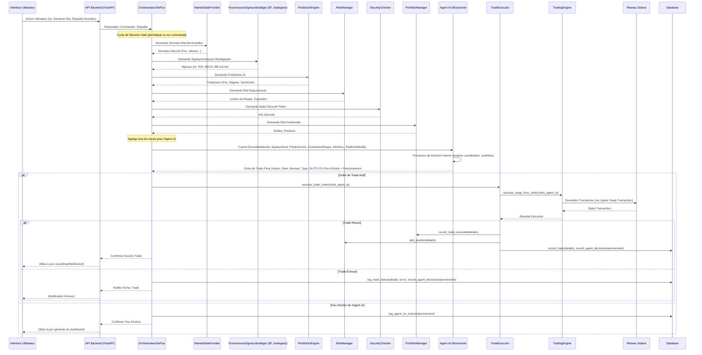

# 🏗️ NumerusX - Architecture & Roadmap

## 📊 État Actuel (Juin 2025)

**Backend**: ✅ 95% TERMINÉ  
**Frontend**: ⚠️ 30% EN COURS  
**Production**: ❌ 10% À FAIRE  

➡️ **PRIORITÉ ABSOLUE**: Frontend (voir `2-FRONTEND-CRITICAL.md`)

## 📋 TODO Simplifiés
1. `1-BACKEND-DONE.md` - ✅ Backend terminé
2. `2-FRONTEND-CRITICAL.md` - 🚨 URGENT: Interface utilisateur
3. `3-PRODUCTION-FEATURES.md` - 🚀 Après frontend: Production & features avancées

---

# Architecture Applicative Globale 🎯

**Objectif**: Architecture cohérente pour NumerusX avec **Agent IA décisionnel central** pour trading intelligent sur Solana.

## I. Principes Architecturaux Clés

L'architecture de NumerusX repose sur les principes fondamentaux suivants :

-   **Modularité et Couplage Faible**: Chaque composant majeur (Acquisition de Données, Génération de Features/Signaux Stratégiques, Moteurs de Prédiction IA, **Agent IA Décisionnel Central**, Gestion des Risques, Exécution des Trades, Sécurité, Interface Utilisateur) est conçu pour être aussi indépendant que possible, communiquant via des interfaces bien définies.
-   **Performance et Asynchronisme au Cœur**: L'utilisation intensive de `asyncio` est cruciale. La boucle de trading principale, centrée sur l'Agent IA, doit rester réactive.
-   **Robustesse et Résilience**: Gestion d'erreurs exhaustive, mécanismes de fallback, et logiques de reintentions intelligentes.
-   **Évolutivité et Extensibilité**: L'architecture doit permettre l'ajout aisé de nouvelles sources de données, de modules fournisseurs de signaux (stratégies), de modèles d'IA pour l'Agent, et de fonctionnalités.
-   **Configuration Centralisée et Flexible**: `app/config.py` reste la source de vérité.
-   **Journalisation Compréhensible et Structurée**: Crucial pour tracer les décisions de l'Agent IA et les inputs qui y ont mené.
-   **Sécurité Intégrée ("Security by Design")**: Reste une préoccupation transversale.

## II. Vue d'Ensemble de l'Architecture (Diagramme Global Centré sur l'Agent IA)

Ce diagramme illustre les principaux composants de NumerusX et leurs interactions, mettant en évidence le rôle central de l'Agent IA.

```mermaid
graph TD
    subgraph "Utilisateur & Contrôle Externe"
        UI["Interface Utilisateur React/ShadCN/UI<br>(numerusx-ui/)"]
    end

    subgraph "Couche API Backend"
        API_BACKEND["API Backend FastAPI<br>(app/main.py, app/api_routes.py)"]
    end

    subgraph "Orchestration & Logique de Base"
        MAIN["Point d'Entrée<br>(app/main.py)"]
        BOT["Orchestrateur de Flux<br>(app/dex_bot.py)"]
        CONFIG["Configuration<br>(app/config.py)"]
        LOGGER["Journalisation<br>(app/logger.py)"]
        DB["Base de Données SQLite<br>(app/database.py)"]
        JUP_CLIENT["JupiterApiClient<br>(app/utils/jupiter_api_client.py)"]
    end

    subgraph "Fournisseurs de Données & Signaux"
        MDP["Fournisseur de Données de Marché<br>(app/market/market_data.py)"]
        EXT_DEX["API DexScreener"]
        EXT_SOCIAL["APIs Sociales/News (Future)"]
        
        SF["Cadre de Stratégies (Fournisseur de Signaux)<br>(app/strategy_framework.py)"]
        USER_STRATS["Stratégies Spécifiques (Input Sources)<br>(app/strategies/)"]
        STRAT_ADV["Analyse Technique Avancée (Input Source)<br>(app/analytics_engine.py)"]
        
        PE["Moteur de Prédiction IA (Input Source)<br>(app/prediction_engine.py)"]
        PP["Prédicteur de Prix (ML/DL)"]
        MRC["Classifier Régime Marché (Future)"]
        SP["Analyseur de Sentiment (Future)"]
        %% ADV_AI[Modules IA Avancés (GNN, TDA, Causal, etc.)]
    end

    subgraph "Noyau Décisionnel Intelligent"
        AI_AGENT["<<Agent IA Décisionnel Central>>\n(app/ai_agent.py)\n(Implémentation via Gemini)"]
    end
    
    subgraph "Contrôle & Validation Pré-Trade"
        RISK["Gestionnaire de Risques<br>(app/risk_manager.py)"]
        SEC["Vérificateur de Sécurité Token<br>(app/security/security.py)"]
        PORTFOLIO["Gestionnaire de Portefeuille<br>(app/portfolio_manager.py)"]
    end

    subgraph "Exécution & Interaction Blockchain"
        EXEC["Exécuteur de Trade<br>(app/trade_executor.py)"]
        TE["Moteur d'Exécution de Trades<br>(app/trading/trading_engine.py)"]
        SOL["Réseau Solana & DEXs"]
    end

    subgraph "Outils de Développement & Évaluation"
        BACKTEST["Moteur de Backtesting"]
    end

    %% Liaisons
    UI --> API_BACKEND
    API_BACKEND --> BOT

    BOT --> CONFIG
    BOT --> LOGGER
    BOT --> DB

    BOT --> MDP
    MDP --> JUP_CLIENT
    MDP --> EXT_DEX
    MDP --> EXT_SOCIAL

    BOT --> SF
    SF --> USER_STRATS
    USER_STRATS --> AI_AGENT
    %% Stratégies fournissent des inputs à l'Agent
    STRAT_ADV --> AI_AGENT
    %% Analyse technique fournit inputs à l'Agent
    
    BOT --> PE
    PE --> PP
    PE --> MRC
    PE --> SP
    PE --> AI_AGENT
    %% Prédictions IA fournissent inputs à l'Agent
    %% ADV_AI --> AI_AGENT

    BOT --> RISK
    BOT --> SEC
    BOT --> PORTFOLIO

    RISK --> AI_AGENT
    %% Contraintes de risque pour l'Agent
    SEC --> AI_AGENT
    %% Contraintes de sécurité pour l'Agent
    PORTFOLIO --> AI_AGENT
    %% État du portefeuille pour l'Agent
    MDP --> AI_AGENT
    %% Données de marché directes pour l'Agent

    AI_AGENT --> BOT
    %% L'Agent retourne la décision finale au Bot orchestrateur
    BOT --> EXEC
    %% Le Bot transmet l'ordre de l'Agent à l'exécuteur

    EXEC --> TE
    EXEC --> PORTFOLIO
    EXEC --> RISK
    TE --> JUP_CLIENT
    JUP_CLIENT --> SOL

    BACKTEST --> MDP
    BACKTEST --> SF
    BACKTEST --> PE 
    BACKTEST --> AI_AGENT
    %% Backtesting de l'agent lui-même
```

**Boucles de Traitement Redéfinies**:

1.  **Boucle de Décision et Trading Temps Réel (Haute Fréquence / Faible Latence)**:
    `DexBot` (collecte inputs) -> `MarketDataProvider`, `StrategyFramework` (via `StrategySelector` & `app/strategies`), `PredictionEngine`, `RiskManager`, `SecurityChecker`, `PortfolioManager` (tous fournissent des données/signaux/contraintes) -> **`AIAgent`** (analyse l'ensemble des inputs, prend la décision finale de trade) -> `DexBot` (reçoit l'ordre) -> `TradeExecutor` -> `TradingEngine` -> Solana.

2.  **Boucle d'Analyse et Prédiction IA (Quasi Temps Réel / Latence Modérée)**:
    `MarketDataProvider` -> `PredictionEngine` (génère prédictions, classifications de régime, scores de sentiment) -> Ces outputs sont des inputs directs pour l'**`AIAgent`**.

3.  **Boucle d'Apprentissage et Optimisation (Hors Ligne / Arrière-Plan / Différée)**:
    `Database` (données historiques) -> `PredictionEngine` (réentraînement des modèles fournisseurs d'inputs) -> **`AIAgent`** (apprentissage/optimisation de sa propre logique de décision, potentiellement via RL ou meta-learning sur les performances passées et les inputs reçus) -> `BacktestEngine` (pour évaluer l'Agent et les modèles d'input).

## III. Flux de Décision et d'Exécution d'un Trade (Centré sur l'Agent IA)

Ce diagramme illustre le nouveau chemin critique d'une décision de trading.

## IV. Décomposition des Modules et Leurs Rôles Clés (avec Agent IA)

### A. Couche d'Acquisition et de Gestion des Données (Globalement Inchangée)
-   `app/market/market_data.py` (`MarketDataProvider`): Utilise `JupiterApiClient` pour les données Jupiter.
-   `app/database.py` (`EnhancedDatabase`): Stockera aussi les décisions et raisonnements de l'Agent IA.

### B. Couche de Génération de Features et Signaux (Anciennement Analyse et IA)

Les modules de cette couche sont redéfinis pour agir comme des fournisseurs d'informations structurées à l'Agent IA. Leurs outputs doivent être standardisés (ex: dictionnaires Python bien définis ou objets Pydantic) pour faciliter l'agrégation par `DexBot` et la consommation par l'`AIAgent`. Voir l'exemple de structure `aggregated_inputs` dans `todo/02-todo-ai-api-gemini.md`.

-   **`app/analytics_engine.py` (`AdvancedTradingStrategy` en tant que fournisseur de features TA)**:
    -   **Rôle Redéfini**: Génère des indicateurs techniques avancés et des analyses de structure de marché comme *input* pour l'Agent IA. Ne prend plus de décision de trade finale.
-   **`app/prediction_engine.py` (`PricePredictor`, `MarketRegimeClassifier`, `SentimentAnalyzer`)**:
    -   **Rôle Redéfini**: Fournit des prédictions, classifications et scores de sentiment comme *inputs* pour l'Agent IA.
-   **`app/strategy_framework.py` (`BaseStrategy`) et `app/strategies/`**:
    -   **Rôle Redéfini**: Les stratégies deviennent des "modules de signaux" ou "extracteurs de features". Leur output (`analyze`, `generate_signal`) est un *input* pour l'Agent IA.
-   **`app/strategy_selector.py` (`StrategySelector`)**:
    -   **Rôle Redéfini**: Pourrait être utilisé par `DexBot` pour **pré-sélectionner ou pré-filtrer un ensemble de signaux ou de stratégies jugées pertinentes** pour le contexte de marché actuel (par exemple, en se basant sur une détection de régime de marché simple ou une configuration utilisateur). Ces signaux préparés (outputs de `analyze`/`generate_signal` des stratégies sélectionnées et potentiellement enrichis de méta-données par le `StrategySelector`) seraient ensuite inclus par `DexBot` dans le dictionnaire `aggregated_inputs` fourni à l'`AIAgent`. L'`AIAgent` ne communique pas directement avec le `StrategySelector`. **L'Agent IA (`Gemini`) conserve la responsabilité finale de l'analyse, de la pondération, et de la décision basée sur l'ensemble des inputs reçus**, y compris ceux potentiellement filtrés ou mis en évidence par le `StrategySelector`. Le `StrategySelector` ne prend pas la décision finale et n'impose pas une stratégie unique, mais peut aider à réduire le "bruit" ou à focaliser l'attention de l'AIAgent sur les inputs les plus prometteurs pour une situation donnée. Il peut également enrichir les signaux des stratégies avec des **méta-données** (ex: performance historique de la stratégie, type de signaux qu'elle génère, conditions idéales d'opération) pour aider l'AIAgent dans son processus d'évaluation et de synthèse.

### C. Couche Noyau Décisionnel Intelligent (Nouveau)

-   **`app/ai_agent.py` (`AIAgent`)**:
    -   **Rôle**: Le nouveau cœur décisionnel. Reçoit tous les inputs pertinents (données de marché, signaux des stratégies, prédictions IA, contraintes de risque/sécurité, état du portefeuille). L'implémentation initiale s'appuiera sur un modèle LLM avancé (ex: Google Gemini). Pour ce faire, il s'interface avec le `GeminiClient` (défini dans `app/ai_agent/gemini_client.py`), qui utilise la bibliothèque `google-generativeai` pour communiquer avec l'API Google Gemini.
    -   **Logique Interne**: Contient la logique (ML, RL, ensemble de modèles, heuristiques avancées) pour synthétiser ces inputs et générer un ordre de trade final et optimal.
    -   **Output**: Ordre de trade précis ou décision de ne pas trader, accompagné d'un "raisonnement" loggable.
    -   **Interactions**: Reçoit des données de multiples modules via `DexBot`. Retourne sa décision à `DexBot`.

### D. Couche de Contrôle et Validation Pré-Décision (Alimente l'Agent IA)

-   **`app/dex_bot.py` (`DexBot` en tant qu'Orchestrateur de Flux)**:
    -   **Rôle Redéfini**: Orchestre la collecte de tous les inputs nécessaires depuis les divers modules. Transmet ces inputs à l'`AIAgent`. Reçoit l'ordre final de l'`AIAgent` et le transmet à `TradeExecutor`.
-   **`app/portfolio_manager.py` (`PortfolioManager`)**:
    -   **Rôle**: Fournit l'état actuel du portefeuille (cash, positions) comme *input* à l'`AIAgent`. Toujours mis à jour par `TradeExecutor` post-trade.
-   **`app/risk_manager.py` (`RiskManager`)**:
    -   **Rôle**: Calcule les limites de risque, la taille de position potentielle maximale, etc., comme *contraintes* ou *inputs* pour l'`AIAgent`.
-   **`app/security/security.py` (`SecurityChecker`)**:
    -   **Rôle**: Fournit des informations sur la sécurité des tokens comme *input* à l'`AIAgent`.

### E. Couche d'Exécution (Globalement Inchangée)
-   `app/trade_executor.py` (`TradeExecutor`): Exécute l'ordre spécifique fourni par `DexBot` (qui vient de l'`AIAgent`).
-   `app/trading/trading_engine.py` (`TradingEngine`): Interagit avec le réseau Solana, notamment via `JupiterApiClient` pour les opérations sur les DEXs Jupiter (swaps, ordres limités, etc., en utilisant le `jupiter-python-sdk`).

### F. Couche de Présentation et Contrôle (UI)
-   **`numerusx-ui/` (Nouvelle Application Frontend React)**:
    -   **Rôle**: Interface utilisateur moderne, réactive et riche en fonctionnalités pour le contrôle et la visualisation du bot NumerusX.
    -   **Technologies**: React, ShadCN/UI, Tailwind CSS, Recharts, Redux, Socket.io, Clerk/Auth0, i18next.
    -   **Interactions**: Communique avec le backend (FastAPI, via `app/main.py` et les routes définies dans des modules comme `app/api_routes.py`) via des API REST et des WebSockets (Socket.io) pour les données en temps réel et les actions de contrôle. Les détails spécifiques des endpoints REST et des événements Socket.io sont documentés dans `todo/01-todo-ui.md` (Phase 4) et `todo/01-todo-core.md` (Tâches 1.10.1 et 1.10.5).
    -   Doit être capable d'afficher :
        -   Le raisonnement de l'Agent IA pour chaque trade.
        -   L'état de l'Agent IA.
        -   Potentiellement des visualisations des inputs clés que l'Agent a considérés.
        -   Tous les panneaux et fonctionnalités décrits dans `todo/01-todo-ui.md`.
-   **Suppression de `app/dashboard.py` et `app/gui.py`**: Ces modules basés sur NiceGUI sont remplacés par la nouvelle application frontend React.

### G. Utilitaires et Monitoring (Globalement Inchangés)
-   `app/config.py` (`Config`)
-   `app/logger.py` (`DexLogger`)
-   **Nouveau Rôle Important**: `app/utils/jupiter_api_client.py` (`JupiterApiClient`):
    -   **Rôle**: Client centralisé pour toutes les interactions avec l'API Jupiter v6 en utilisant le `jupiter-python-sdk`. Fournit des méthodes pour les cotations, swaps, ordres limités, DCA, etc., aux modules `MarketDataProvider` et `TradingEngine`. Gère la communication directe avec le réseau Solana pour l'envoi des transactions construites par le SDK Jupiter.

## V. Stratégies de Performance et de Coordination

-   **Latence de Décision de l'Agent IA**: Le design de l'`AIAgent` doit être optimisé pour une prise de décision rapide.
-   **Qualité et Pertinence des Inputs**: L'efficacité de l'Agent dépendra de la qualité des données et signaux qu'il reçoit.

## VI. Intégration des Fonctionnalités Avancées (Revu avec Agent IA)

-   Toutes les fonctionnalités avancées (MAC-MM, GNN Liquidité, TDA, Swarm Intelligence, etc.) de `todo/03-todo-advanced-features.md` deviennent des sources d'input potentielles ou des méthodes d'amélioration pour l'`AIAgent` lui-même.
-   "Shadow Trading", "Deep RL Portfolio Management" pourraient être des modes de fonctionnement ou des logiques internes de l'`AIAgent`.
-   "Rapports de Décision LLM" devient le "raisonnement" de l'`AIAgent`.

## VII. Versionnement du Document d'Architecture

-   Envisager un versionnement du document d'architecture au fur et à mesure de l'évolution du projet.

## VIII. Considérations Futures / Améliorations (Revue Stratégique)

* **Backtesting de l'Agent IA**: Développer des outils pour backtester la performance de l'Agent IA lui-même, en simulant le flux d'inputs qu'il aurait reçu.
* **Apprentissage Continu**: Mettre en place des mécanismes pour que l'Agent IA puisse apprendre et s'adapter avec le temps (ex: RL, feedback sur ses propres trades).
* **Optimisation des Prompts pour Gemini**: Affiner continuellement les prompts pour améliorer la qualité des décisions et la gestion des tokens.
* **Diversification des Modèles d'IA**: Envisager l'intégration d'autres modèles (spécialisés ou généralistes) en parallèle ou en fallback de Gemini au sein de l'`AIAgent`.
* **Simulation Avancée ("Digital Twin")**: Développer un jumeau numérique de l'environnement de trading pour des tests et optimisations plus poussés.

## IX. Stratégie de Tests d'Intégration

L'objectif des tests d'intégration est de s'assurer que les différents modules de NumerusX communiquent et fonctionnent correctement ensemble, en particulier le flux de décision principal impliquant l'Agent IA.

### A. Types de Tests d'Intégration

1.  **Tests de Contrat d'Interface (Inter-Modules)**:
    *   **Objectif**: Vérifier que les données échangées entre les modules respectent les formats et schémas attendus (ex: Pydantic models).
    *   **Exemples**:
        *   `DexBot` <-> `MarketDataProvider`: Format des données de marché.
        *   `DexBot` -> `AIAgent`: Format des `aggregated_inputs`.
        *   `AIAgent` -> `DexBot`: Format de la décision de trade.
        *   `DexBot` -> `TradeExecutor`: Format de l'ordre de trade.
        *   `TradeExecutor` -> `TradingEngine`: Format des paramètres de swap/ordre.
        *   `TradingEngine` <-> `JupiterApiClient`: Appels et retours du SDK.
        *   API Backend (FastAPI) <-> UI (React): Contrats des endpoints REST et événements Socket.io.
    *   **Outils**: `pytest`, mocks pour isoler les paires de modules testées.

2.  **Tests de Scénarios de Bout en Bout (Core Logic)**:
    *   **Objectif**: Simuler des cycles de trading complets, de la collecte de données à l'exécution (simulée) d'un trade, en passant par la décision de l'IA.
    *   **Exemples de Scénarios**:
        *   Un signal "BUY" fort est généré, l'IA confirme, un ordre est passé.
        *   Données de marché contradictoires, l'IA décide "HOLD".
        *   Erreur de l'API Jupiter, le système gère l'erreur et se met en pause ou fallback.
        *   L'API Gemini est indisponible, l'IA fallback sur "HOLD".
        *   Un utilisateur interagit avec l'UI pour démarrer/arrêter le bot, vérifier le statut.
    *   **Approche**:
        *   Utiliser un environnement de test avec des versions mockées des services externes (API Jupiter, API Gemini, Blockchain Solana).
        *   Injecter des données de scénario spécifiques.
        *   Vérifier les états intermédiaires, les logs, et les décisions/actions finales.

3.  **Tests d'Intégration API Backend et UI**:
    *   **Objectif**: S'assurer que l'UI peut correctement interagir avec les endpoints API du backend et recevoir/afficher les mises à jour via WebSockets.
    *   **Exemples**:
        *   L'utilisateur se connecte, le token JWT est validé par le backend.
        *   L'UI affiche les données du portefeuille reçues via API/Socket.io.
        *   L'utilisateur démarre le bot via l'UI, le backend reçoit la commande.
        *   Une nouvelle décision de l'IA est prise, l'UI l'affiche en temps réel.
    *   **Outils**: Frameworks de test UI (ex: Playwright, Cypress) pour les tests E2E, `pytest` pour les tests d'API backend avec un client de test FastAPI.

### B. Environnement de Test

*   Un environnement Docker Compose dédié aux tests d'intégration sera configuré.
*   Ce dernier utilisera des mocks pour les services externes (APIs tierces, blockchain).
*   Une base de données de test distincte sera utilisée et réinitialisée avant chaque suite de tests.

### C. Outillage et Automatisation

*   **Framework Principal**: `pytest` pour la majorité des tests backend et d'intégration de logique.
*   **Mocks**: `unittest.mock` (Python), `nock` ou `msw` (pour les appels HTTP/API côté UI si nécessaire).
*   **Tests UI E2E**: Playwright ou Cypress (à évaluer).
*   **Intégration Continue (CI)**: Les tests d'intégration seront exécutés automatiquement dans le pipeline de CI (ex: GitHub Actions) à chaque push ou pull request sur les branches principales.

### D. Focus Particuliers

*   **Flux de Données de l'Agent IA**: Tester en profondeur la collecte, l'agrégation, la transmission à l'IA, et le parsing de la réponse.
*   **Gestion des Erreurs et Fallbacks**: Scénarios spécifiques pour tester la résilience du système.
*   **Communication Temps Réel (Socket.io)**: Vérifier la latence et la fiabilité de la transmission des messages.
*   **Sécurité**: Tests d'intégration pour les flux d'authentification et d'autorisation.

Cette stratégie sera affinée et détaillée au fur et à mesure du développement des fonctionnalités.

## Points d'Attention / Risques / Ambiguïtés (0-architecte.md - Étendu avec Revue Stratégique)
* **Complexité**: L'architecture proposée est complète avec de nombreux composants interconnectés ; la gestion de cette complexité sera un défi.
* **Dépendance IA Agent**: La performance et la fiabilité de l'AIAgent (via Google Gemini initialement) sont critiques. Dépendance aux APIs externes (disponibilité, coût, limitations).
* **Flux de Données**: Les formats et schémas exacts pour la communication inter-modules, notamment les `aggregated_inputs` pour l'AIAgent, nécessitent une définition méticuleuse et une validation continue de leur peuplement complet.
* **Scalabilité AIAgent**: Anticiper les goulots d'étranglement potentiels de l'AIAgent.
* **Évolution des "Stratégies"**: Le rôle des stratégies comme fournisseurs de signaux/features pour l'AIAgent est un changement conceptuel important.
* **Rôle du `StrategySelector`**: L'interaction avec l'AIAgent doit être implémentée avec soin pour que l'AIAgent utilise efficacement les entrées pré-filtrées.
* **Remplacement UI**: Le passage de NiceGUI à React/FastAPI est un changement majeur.
* **Authentification et API Backend**: Standardisation nécessaire entre les mécanismes d'authentification potentiellement dupliqués (`app.security.security` vs. `app.utils.auth`) et consolidation des points d'entrée API (`app.main.py` vs. `app.api_routes.py`).
* **Initialisation des Dépendances**: Clarifier l'injection de dépendances pour des composants comme `MarketDataProvider` dans `TradingEngine`.

### Suggestions (0-architecte.md - Étendu avec Revue Stratégique)
* Envisager un versionnement du document d'architecture au fur et à mesure de l'évolution du projet.
* **Standardiser le Logging**: Migrer vers l'utilisation standard de `logging.getLogger(__name__)` et supprimer les loggers custom comme `DexLogger`.
* **Validation des Données**: Renforcer la validation des données à toutes les interfaces, notamment pour la base de données (`EnhancedDatabase.record_trade`) et les réponses de l'IA (Pydantic pour la réponse Gemini).
* **Configuration Claire**: Rendre les configurations clés (ex: coûts de tokens Gemini, `max_output_tokens`) explicites dans `app.config.py`.